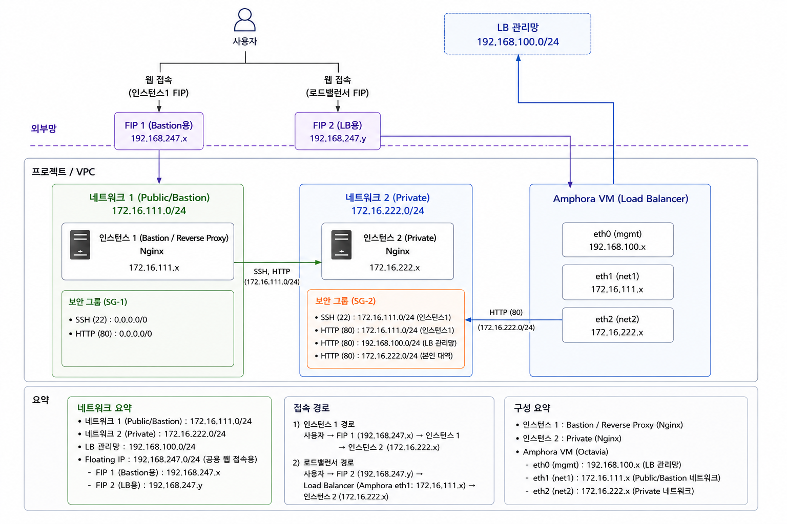

# Openstack_IaC
목표: Terraform과 Ansible을 결합하여 OpenStack 환경 위에 Bastion(Nginx 리버스 프록시) 서버, Private 네트워크 내 백엔드 웹 서버, 그리고 이들을 연동하는 Octavia 로드밸런서 환경을 프로비저닝하고 구축하기

# 아키텍처 다이어그램


# 디렉토리 구조
/root/terraform/
├── modules/               # 기존 모듈들은 여기에 모아둡니다.
│   ├── network/           # - vpc, subnet, rbac 설정 등
│   │   ├── main.tf
│   │   ├── outputs.tf
│   │   └── variables.tf   # - security, compute, loadbalancer까지 동일
│   ├── security/          # - sg, sg_rule, rbac 설정 등
│   │   ├── main.tf
│   │   └── outputs.tf
│   ├── compute/           # - instances, flavors 등
│   │   ├── main.tf
│   │   ├── outputs.tf
│   │   └── variables.tf
│   └── loadbalancer/      # - lb, listener, pool, member 등
│   │   ├── main.tf
│   │   ├── outputs.tf
│   │   └── variables.tf
│
├── infra/                 # [1단계 실행] 기반 인프라 구축용
│   ├── main.tf            # - network, security, compute 모듈 호출
│   ├── providers.tf       # - 오픈스택 접속 설정
│   ├── variables.tf       # - 변수 정의
│   ├── outputs.tf         # - 생성된 ID 출력
│   └── ansible_vars.tf    # - ansible/tf_vars.yml 파일 생성
│
└── loadbalancer/          # [2단계 실행] 로드밸런서 구축용
    ├── main.tf            # - loadbalancer 모듈 호출
    └── providers.tf       # - 오픈스택 접속 설정

/root/ansible/
├── ansible.cfg            # 앤서블 기본 환경 설정 파일 (호스트 키 확인 비활성화 등)
├── hosts.ini              # 테라폼에 의해 자동 생성되는 인벤토리 파일 (Proxy 및 Backend 서버 접속 정보)
├── octavia.conf.j2        # 오픈스택 로드밸런서(Octavia) 설정 파일 생성을 위한 템플릿 파일
├── reverse-proxy.conf.j2  # 프록시 서버(Instance 1)의 Nginx 리버스 프록시 설정용 템플릿 파일
├── setup-octavia.yml      # Octavia 로드밸런서 인프라 구축 및 자동화를 완료하는 플레이북
├── setup-web.yml          # 프록시 및 백엔드 서버에 Nginx를 설치하고 연동하는 웹서버 설정 플레이북
└── tf_vars.yml            # 테라폼 실행 결과(IP, MAC, Flavor ID 등)를 앤서블 변수로 저장한 파일

# 실행 순서
1. 기반 인프라 생성
```
cd /root/terraform/infra
terraform init
terraform apply -auto-approve
```
2. 서버 및 서비스 설정
```
cd /root/ansible
ansible-playbook setup-web.yml -e @tf_vars.yml
ansible-playbook setup-octavia.yml -e @tf_vars.yml
```
3. 로드밸런서 생성 및 연동
```
cd /root/terraform/loadbalancer
terraform init
terraform apply -auto-approve
```

